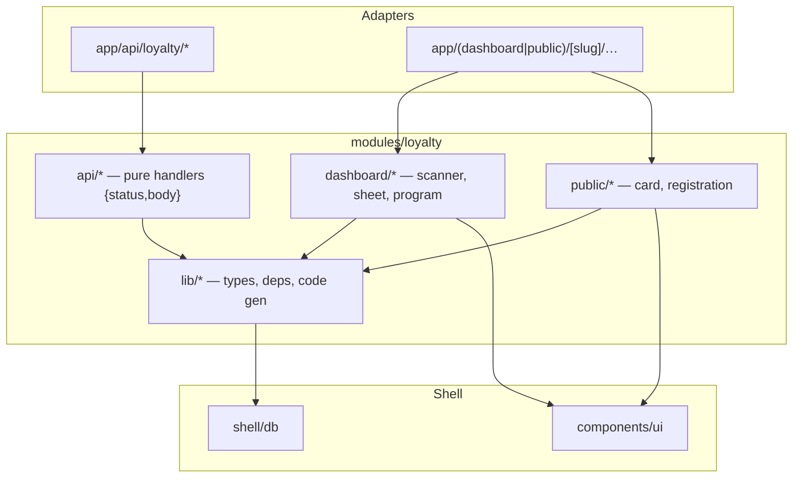
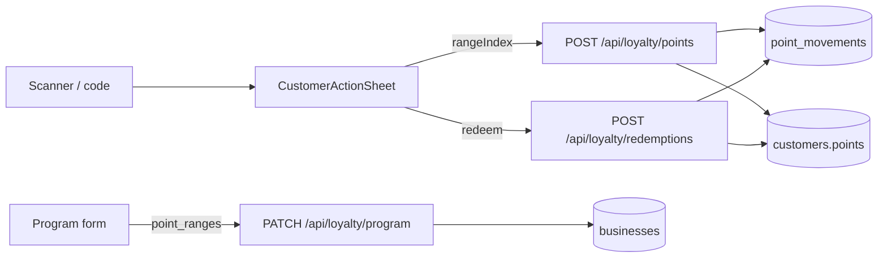
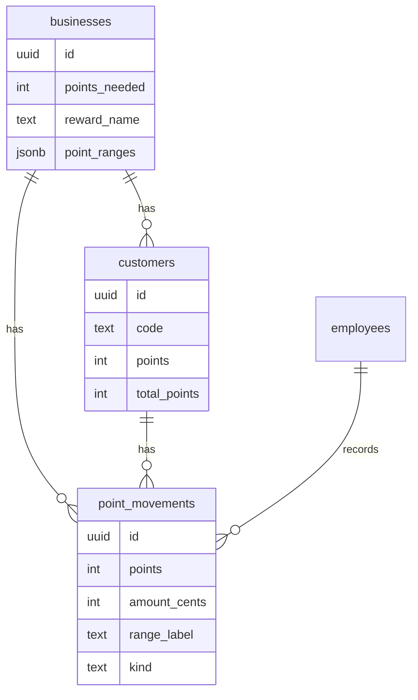

# Architecture Spine — loyalty-qr-scan-points

## Design Paradigm

**Modular monolith por dominio.** El módulo `modules/loyalty` es el dueño del dominio (API pura + lib + UI dashboard/public). `app/api/*` y `app/(…)/page.tsx` son thin adapters. `components/ui` es shell de primitivos. `shell/db` es infraestructura compartida.



## Invariants & Rules

### AD-1 — Domain ownership [ADOPTED]

- **Binds:** all loyalty code
- **Prevents:** business logic in route handlers or React components
- **Rule:** Domain mutations live in `modules/loyalty/api/*` as dep-injected functions returning `{ status, body }`. Routes only auth + map HTTP. UI only calls APIs / renders.

### AD-2 — Points-native clean slate

- **Binds:** schema, APIs, UI copy, metrics
- **Prevents:** dual compra/punto semantics; dual ledgers
- **Rule:** Migration `003`: `customers.purchases→points`, `total_purchases→total_points`; `businesses.purchases_needed→points_needed`; rename table `purchases` → `point_movements` with columns `(id, customer_id, employee_id, business_id, points INT NOT NULL, amount_cents INT NULL, range_label TEXT NULL, kind TEXT CHECK (kind IN ('earn','redeem')), created_at)`. **Drop table `redemptions`** — redeem is `kind='redeem'` in `point_movements` only (one ledger). No dual-write. No compat layer. UI strings say "puntos".

### AD-3 — Ranges as JSONB on businesses

- **Binds:** program config, earn resolution
- **Prevents:** extra table + divergent range sources + invalid cuts
- **Rule:** `businesses.point_ranges JSONB NOT NULL DEFAULT '[]'`. Shape: ordered array of `{ min_cents: int≥0, max_cents: int|null, points: int≥0 }`. Server validation on PATCH (reject otherwise): (1) length ≥ 1; (2) strictly increasing mins; (3) each non-last has `max_cents === next.min_cents` (contiguous, no gaps/overlaps); (4) last has `max_cents === null`; (5) every non-last `max_cents > min_cents`; (6) at most one leading band may have `points === 0` (the below-min floor); all other bands `points > 0`. Picker and earn resolver only offer bands with `points > 0`. Empty array after validate is invalid if program is active — seed default ranges on migration matching prior single-threshold behavior is out of scope; owner must configure.

### AD-3a — Earn resolves server-side from rangeIndex

- **Binds:** earn API + sheet
- **Prevents:** client-supplied points bypassing config; stale-range wrong credit
- **Rule:** Earn body is **only** `{ customerId: string, rangeIndex: number, force?: boolean }`. Server loads current `point_ranges[rangeIndex]`; if missing or `points <= 0` → `400`. Credits **that** band's `points` / `min_cents` / derived `range_label` — never trust client points. Optional: if client also sends `expectedPoints` and it ≠ band.points → `409 RANGE_CHANGED` (sheet reloads). Prefer `expectedPoints` check in MVP.

### AD-4 — QR payload is canonical public URL

- **Binds:** card QR generation, scanner parse, deep link
- **Prevents:** opaque tokens or mismatched paths
- **Rule:** Payload is exactly `/{slug}/loyalty/c/{code}` where `code` is `customers.code` (4 digits). Generate with existing `qrcode@1.5.4`. Absolute URL uses the app origin at render time.

### AD-5 — Action gate = employee/owner session

- **Binds:** earn, redeem, sheet actions
- **Prevents:** customer-side mutations; cross-business actions
- **Rule:** Earn/redeem require `validateSession` → same `businessId` as customer. Public QR page without session = read-only card. With employee session for that business → redirect to `/{slug}/dashboard/loyalty?c={code}` which opens the action sheet.

### AD-6 — Scanner is the primary employee loyalty view

- **Binds:** dashboard loyalty entry
- **Prevents:** list and scanner competing as defaults
- **Rule:** `/{slug}/dashboard/loyalty` default UI = in-app scanner. Plan B: secondary control "¿No funciona el QR?" opens existing 4-digit code flow (and list remains reachable from there). Do not delete code-entry capability.

### AD-7 — One bottom sheet primitive

- **Binds:** post-scan action UI
- **Prevents:** second drawer library / parallel sheet components
- **Rule:** Use existing `components/ui/sheet.tsx` with `side="bottom"`. Single `CustomerActionSheet`: large name greeting, progress, **SUMAR PUNTOS** → range picker (only `points > 0`), confirm screen "N puntos a {Name}", redeem banner when `points >= points_needed`. No vaul/drawer install for MVP. Close via X / overlay / Escape.

### AD-8 — Scanner library pin

- **Binds:** camera scan UI
- **Prevents:** ad-hoc zxing wrappers
- **Rule:** Use `@yudiel/react-qr-scanner@2.6.0`. On decode: accept only same-origin paths matching `/{slug}/loyalty/c/{code}` (and distinguish program-registration QR if path matches known register URL). Foreign QR → friendly error, keep scanning.

### AD-9 — Anti-duplicate window

- **Binds:** earn path
- **Prevents:** double-tap / double-scan same sale
- **Rule:** Client: disable confirm 2s after success. Server: if latest `point_movements` earn for same `customer_id`+`business_id` is `< 60s` ago and request lacks `force: true`, return `409` body `{ code: 'DUPLICATE_RECENT' }`. UI then shows extra confirm; retry with `force: true`.

### AD-10 — API surface rename

- **Binds:** HTTP contracts, tests
- **Prevents:** parallel purchase + points endpoints; freeform points body
- **Rule:**
  - `POST /api/loyalty/points` is the only earn endpoint; delete `POST /api/loyalty/purchases` in the same PR as 003 (update all callers/tests).
  - Earn body **only** per AD-3a: `{ customerId, rangeIndex, force?, expectedPoints? }`.
  - `POST /api/loyalty/redemptions` kept path: body `{ customerId }`; server requires `customer.points >= business.points_needed` else `400`; then in one transaction set `points = 0`, insert `point_movements kind='redeem'` with `points = -redeemed` (or positive points field + kind distinguishes — **use positive magnitude + kind**). No writes to a `redemptions` table.
  - `PATCH /api/loyalty/program`: `{ points_needed, reward_name, point_ranges }` with AD-3 validation.
  - Customer DTOs expose `points` / `total_points` (not purchases).

### AD-10a — Balance mutation algebra (transactions)

- **Binds:** earn + redeem domain functions
- **Prevents:** lost updates; total_points drift; partial ledger
- **Rule:** Earn and redeem run in a **single SQL transaction**: `SELECT … FROM customers WHERE id AND business_id FOR UPDATE` → compute new balance → `UPDATE customers` → `INSERT point_movements` → commit. Earn: `points += band.points`, `total_points += band.points`. Redeem: require `points >= points_needed`; `points = 0`; `total_points` unchanged; movement `kind='redeem'`, `points` = amount redeemed (pre-zero balance). Never update balance without a movement row in the same tx.

### AD-11 — Dependency direction

- **Binds:** imports across packages
- **Prevents:** cycles; SQL in components
- **Rule:** `app/api` → `modules/loyalty/api` + `default-deps` only. `dashboard/*` and `public/*` → `lib` + `components/ui` + fetch to APIs — never import `shell/db` directly. `modules/loyalty/api` must not import React or UI. SQL only in `api/*` via injected `sql` and in `shell/db` / migrations.

### AD-12 — Money as integer cents

- **Binds:** ranges, movements, forms
- **Prevents:** float money; unit ambiguity
- **Rule:** All amounts stored as `amount_cents` / `min_cents` / `max_cents` integers. UI formats for display (thousands ARS). Earn from range picker stores `amount_cents = range.min_cents` (representative) + `range_label` derived from bounds — employee does not type exact ticket amount in MVP.



## Consistency Conventions

| Concern | Convention |
| --- | --- |
| Naming files | kebab-case files; `CustomerActionSheet` / `LoyaltyScanner` in `modules/loyalty/dashboard/` |
| Naming domain | `points`, `point_ranges`, `point_movements`, `rangeIndex` — never reintroduce `purchases` after 003 |
| IDs | UUID strings as today; customer code = 4-digit string |
| API envelope | `{ status, body }` from domain; HTTP JSON body = `body`; errors `{ error: string, code?: string }` |
| Auth | `session_token` cookie → `validateSession` → `{ id: employeeId, businessId }` |
| Config | Program fields on `businesses` row; ranges JSONB co-located |
| Tests | `tests/loyalty-*.test.ts` domain; `tests/ui/*` components; bun test; TDD red→green |
| Copy UI | Spanish product strings; code identifiers English |

## Stack

| Name | Version |
| --- | --- |
| next | 16.2.12 |
| react / react-dom | 19.2.4 |
| @base-ui/react | ^1.7.0 |
| tailwindcss | 4 |
| postgres (js) | ^3.4.9 |
| qrcode | 1.5.4 |
| @yudiel/react-qr-scanner | 2.6.0 *(add)* |
| typescript | 5 |
| bun test | project runner |

## Structural Seed

```text
shell/db/migrations/
  003_loyalty_points_native.sql

app/(public)/[slug]/loyalty/c/[code]/page.tsx   # public card by code + employee redirect
app/(dashboard)/[slug]/dashboard/loyalty/page.tsx # scanner default (+ ?c= opens sheet)
app/api/loyalty/points/route.ts
app/api/loyalty/purchases/route.ts               # remove or 410 after cutover

modules/loyalty/
  api/points.ts                                  # was purchases.ts semantics
  api/program.ts                                 # + point_ranges validation
  api/redemptions.ts                             # reset points + movement redeem
  lib/types.ts                                   # PointRange, PointMovement, …
  lib/parse-loyalty-qr.ts                        # URL → {slug,code} | null
  lib/default-deps.ts
  dashboard/loyalty-scanner.tsx
  dashboard/customer-action-sheet.tsx
  dashboard/program-form.tsx                     # ranges editor
  dashboard/panel.tsx                            # plan-B / list mode
  public/card.tsx                                # + customer QR
```



## Capability → Architecture Map

| Capability | Lives in | Governed by |
| --- | --- | --- |
| Points-native schema | migration 003 | AD-2, AD-12 |
| Range config editor | `program-form.tsx` + `api/program` | AD-3, AD-12 |
| Earn points | `api/points` + sheet confirm | AD-1, AD-5, AD-9, AD-10 |
| Redeem | `api/redemptions` + sheet banner | AD-5, AD-7, AD-10 |
| Customer QR | `public/card.tsx` | AD-4 |
| Public deep link | `app/.../loyalty/c/[code]` | AD-4, AD-5 |
| In-app scanner | `loyalty-scanner.tsx` | AD-6, AD-8 |
| Plan B code entry | `panel.tsx` secondary | AD-6 |
| Action sheet UX | `customer-action-sheet.tsx` | AD-7 |

## Deferred

| Item | Why it can wait |
| --- | --- |
| Undo / 0-tap auto-load | Explicit Phase 2 in intent |
| Realtime card refresh beyond poll | Phase 2 |
| Sound/confetti | Phase 2 |
| Rotating dynamic QR | Phase 3 |
| Kiosk mode / Wallet pass | Phase 3 |
| Drag-to-dismiss sheet | Not required; base-ui sheet enough |
| Exact ticket amount entry | MVP uses range representative `min_cents` |
| Separate `loyalty_ranges` table | JSONB sufficient until multi-program |
| Long-lived employee session / PIN | Product concern outside this spine; note only |
| Deployment/env topology | Unchanged brownfield; not owned by this feature altitude |
