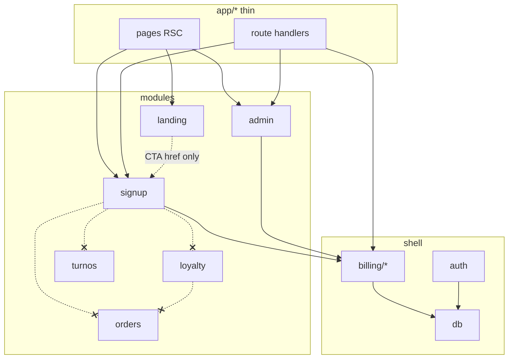
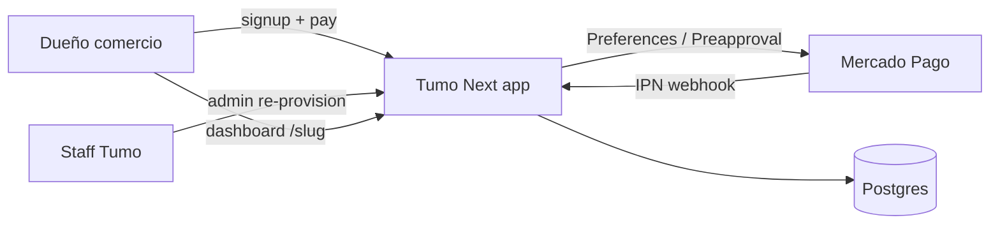
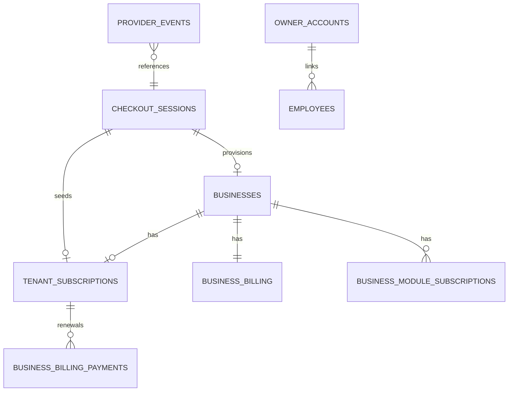
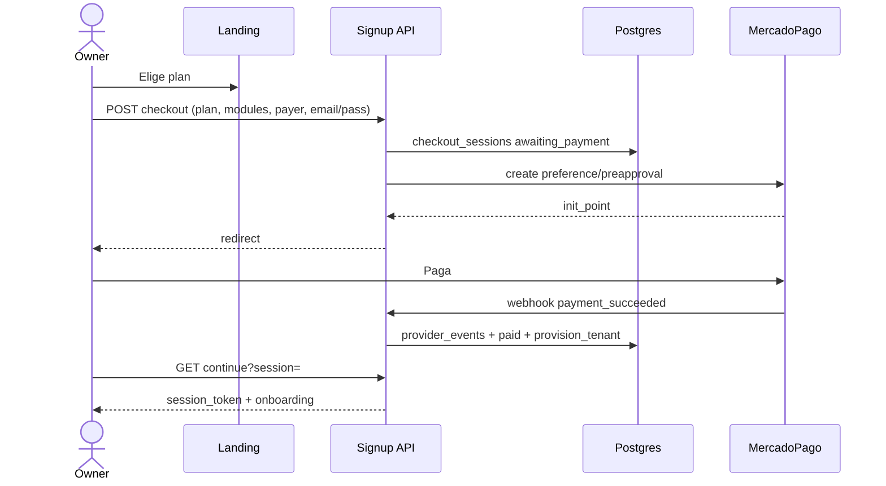

# Architecture Spine — Tumo SaaS MP subscriptions

## Design Paradigm

**Modular monolith + ports & adapters** (igual AUDITORIA Tumo).

| Capa | Path | Rol en esta feature |
|------|------|---------------------|
| Thin adapters | `app/**` | `/`, `/signup/**`, `app/api/signup/**`, `app/api/billing/webhooks/mercadopago/**` |
| Dominio UI/API signup | `modules/signup/**` | Wizard pre-pago + continue post-pago (sin SQL crudo) |
| Billing core | `shell/billing/**` | Catálogo planes, checkout session, provision, provider port, cycle/grace |
| Provider adapter | `shell/billing/provider/mercadopago/**` | Checkout API / Preferences / Preapproval + verify webhook |
| Admin ops | `modules/admin/**` | Lista sessions, re-provision, ver `tenant_subscriptions` |
| Marketing | `modules/landing/**` | PLANS + CTA → signup (flag); **no** llama MP |
| Persistencia | Postgres vía `shell/db` | checkout_sessions, tenant_subscriptions, provider_events, owner_accounts |



## Inherited Invariants

| Inherited | From | Binds here |
|-----------|------|------------|
| No `modules/A` → `modules/B` | AUDITORIA | signup/admin no importan orders/loyalty/turnos |
| `active_modules` = contrato; mora no wipe | billing-pause-on-vencido | provision + renew |
| `hasModuleAccess` = contrato ∩ ¬overdue | `shell/billing/access.ts` | post-pago y mora |
| `business_module_subscriptions` + sync array | admin module-activation | provision módulos |
| Money INT cents; errors `{error, code?}` | AUDITORIA | checkout + payments |
| Dual migrations `shell/db` + `supabase/migrations` | tumo-dev-pitfalls | schema SaaS |
| Staff `/admin/**` no gated por billing tenant | access rules | ops re-provision |
| Landing no escribe `business_billing` | landing-pricing | solo CTA/copy |

## Invariants & Rules

### AD-1 — Pasarela SaaS = Mercado Pago `[ADOPTED]`

- **Binds:** checkout, webhooks, renewals, env secrets
- **Prevents:** dLocal del spec 2026-09-16; dual-provider sin port; reusar `orders_settings.mp_*`
- **Rule:** Un solo adapter concreto v1: `MercadoPagoPaymentProvider`. Credenciales **platform** (`MP_ACCESS_TOKEN`, `MP_WEBHOOK_SECRET`, opcional `MP_PUBLIC_KEY`). Orders/turnos **no** cambian su pasarela de cliente final. Spec dLocal queda histórico; companion MP es SoT de provider.

### AD-2 — Port `PaymentProvider` `[ADOPTED]`

- **Binds:** todo I/O gateway
- **Prevents:** SQL/UI hablando JSON crudo de MP
- **Rule:**
  ```
  PaymentProvider {
    createCheckout(input) → { providerCheckoutId, redirectUrl }
    parseAndVerifyWebhook(raw, headers) → ProviderEvent | error
    getPaymentStatus?(providerPaymentId) → status
    // v1.1: cancel / update card URL
  }
  ```
  `ProviderEvent` normalizado: `payment_succeeded|payment_failed|payment_pending|renewal_succeeded|renewal_failed|subscription_cancelled|chargeback` + `providerEventId`, `externalReference` (= `checkout_sessions.id`), ids MP, amount/currency, `raw`.

### AD-3 — Superficie MP Checkout v1 `[ASSUMPTION]`

- **Binds:** adapter MP
- **Prevents:** embeber Card Form / Smart Checkout fields en v1; APM custom sin necesidad
- **Rule:** Hosted **redirect**. Preferencia de producto:
  1. Si la cuenta habilita **Suscripciones / Preapproval** con cargo mensual → usarlo (mapea plan × month).
  2. Si no → **Preferences** (Checkout Pro / Checkout API preference) one-shot ARS + renovación **iniciada por Tumo** (cron + saved card / authorized payment) o link de recovery.
  3. **Gate de ship:** sandbox primer pago + al menos un renew (o preapproval authorized) antes de prod. Si recurring no está → no ship MVP completo en silencio.
  `external_reference` / metadata order id = `checkout_sessions.id` (UUID). `notification_url` → webhook Tumo. Success/failure URLs solo reanudan UI.

### AD-4 — Modelo comercial: planes por cupo `[ADOPTED]`

- **Binds:** catálogo, cupo, provision modules
- **Prevents:** self-serve N×69.99; “a medida” en checkout
- **Rule:**

  | plan_id | Cupo | USD display/mes | cents lista USD |
  |---------||------|-----------------|-----------------|
  | `basico` | 1 módulo registrable | 39.99 | 3999 |
  | `pro` | hasta 3 | 89.99 | 8999 |
  | `full` | todos self-service del registry al alta | 129.99 | 12999 |

  Unidad de cobro = **plan**. `module_ids` validados server-side vs cupo + `getRegisteredModuleIds()` (loyalty|orders|turnos). Full auto-selecciona todos al checkout; **no** auto-attach módulos nuevos mid-cycle en tenants Full existentes (v1). Custom/a medida = WA/ops, fuera de self-serve.

### AD-5 — Intervalo cobrable v1 = mensual `[ASSUMPTION]`

- **Binds:** checkout, cycle, MP plan frequency
- **Prevents:** week+month dual billing en MVP
- **Rule:** Checkout self-serve cobra **solo `month`**. Refs semanales en landing/FAQ son marketing. `addOneMonthUTC` reusado; `next_due_at = addOneMonthUTC(paidAt)`.

### AD-6 — Moneda y montos `[ADOPTED]`

- **Binds:** session snapshot, MP payload, billing columns
- **Prevents:** FX live por request; mentir `monthly_amount_cents` en ARS con label USD sin columnas
- **Rule:** Mercado v1 AR. Cargo real **ARS**. Catálogo versionado `PRICE_VERSION`. `amount_ars_cents` = **lista fija** plan+interval en config (ops actualiza números). Session guarda snapshot `amount_cents` (ARS minor) + `currency=ARS` + `price_version` + `plan_id`. Display landing puede seguir USD. En boundary MP convertir minor→major según docs (`129.99`).

### AD-7 — Pagar primero + state machine `[ADOPTED]`

- **Binds:** checkout_sessions, provision
- **Prevents:** alta business sin pago confirmado; success URL como única vía
- **Rule:**
  ```
  started → awaiting_payment → paid → provisioned
                 ↘ failed | expired | cancelled
  paid + provision error → queda paid + provision_error; reconciler/admin reintenta
  ```
  Provision **solo** tras `payment_succeeded` verificado. Idempotencia: ≤1 business por `checkout_session_id`. Un email ≤1 session `awaiting_payment`. Expiración lazy/job T+2h sin pago.

### AD-8 — Provision tenant (side effects locked) `[ADOPTED]`

- **Binds:** post-pago
- **Prevents:** half-created tenants; duplicate owners
- **Rule:** Transacción (o pasos idempotentes ordenados):
  1. `businesses` (nombre; slug temporal único si hace falta)
  2. `owner_accounts` + `employees` owner link
  3. activate módulos = misma semántica que `activateModule` (`business_module_subscriptions` + sync `active_modules`)
  4. `tenant_subscriptions` active + provider ids + amount snapshot
  5. upsert `business_billing` `al_dia`, cycle amount, `next_due_at`, `last_payment_at`
  6. session → `provisioned`
  7. email “cuenta lista” best-effort (fallo mail ≠ rollback)
  No borrar business en chargeback; status cancelled/vencido.

### AD-9 — Auth owner self-serve `[ASSUMPTION]`

- **Binds:** signup + login post-pago
- **Prevents:** forzar slug+OTP antes de tener negocio
- **Rule:** v1 introduce `owner_accounts` (email unique, password_hash). Login `/login` (o `/app/login`) email+password → reusa `sessions` + cookie `session_token`. OTP `/{slug}/login` empleados **no se elimina**. Email checkout = login (lower/trim). Hash argon2id o bcrypt. Si producto rechaza email: change request explícito a phone-first (no improvisar a mitad de implement).

### AD-10 — SoT antifrágil `[ADOPTED]`

- **Binds:** webhooks, reconciler, admin
- **Prevents:** “pagué y nada”; double provision
- **Rule:** Tumo DB manda. Todo evento provider → `provider_events` (`provider_event_id` UNIQUE) **antes** de side effects. `applyProviderEvent` idempotente. Success URL poll/read session. Reconciler: `paid`∧¬`provisioned`; MP paid ∧ session awaiting; past_due fuera gracia. Admin **Re-provision**.

### AD-11 — Renovación y mora `[ADOPTED]`

- **Binds:** renew, access
- **Prevents:** cortar acceso al ms del due; wipe módulos
- **Rule:** Renew OK → `al_dia`, avanzar due, `last_payment_at`. Fail → sub `past_due`, billing `pendiente`, **`next_due_at = failedAt + GRACE_HOURS` (48 default)** para no gatillar overdue inmediato. Tras gracia → `vencido` + sub `paused`; `hasModuleAccess` false. **No** `setActiveModules([])`. Recovery: deep link regularizar (nuevo checkout o URL MP).

### AD-12 — Billing amount dual-path `[ADOPTED]`

- **Binds:** pricing.ts, markPaid, tenant_subscriptions
- **Prevents:** forzar N×6999 a self-serve nuevos; romper legacy
- **Rule:** Con `tenant_subscriptions` activa → monto = snapshot plan (preferir columnas `cycle_amount_cents`, `billing_interval`, `currency` en billing o solo en tenant_subscriptions). Sin tenant_subscription (legacy) → admin `N × PRICE_PER_MODULE_CENTS` + markPaid manual. Landing `PLANS` **espejo** de `shell/billing/plan-catalog.ts` (una SoT código; landing importa o re-exporta constants compartidas — **no** hardcode divergente).

### AD-13 — Landing CTA `[ADOPTED]`

- **Binds:** `modules/landing`, feature flag
- **Prevents:** WA como única compra cuando flag on; landing importando provider
- **Rule:** Flag `SELF_SERVICE_SIGNUP=true` → CTA primario plan → `/signup?plan=`. WA secundario soporte. Flag off → WA como hoy. Landing **no** crea sessions ni toca MP.

### AD-14 — Límites de módulo / carpetas `[ADOPTED]`

- **Binds:** structure
- **Prevents:** meter checkout en `modules/landing` o MP en `modules/orders`
- **Rule:** Core en `shell/billing/{plan-catalog,checkout,provider,provision,cycle}`. UI en `modules/signup`. Webhook route solo verify+dispatch. Admin surfaces en `modules/admin`. Tests: `tests/billing-*.test.ts`, `tests/signup-*.test.ts`, `tests/ui/signup-*.test.tsx`.

## Consistency Conventions

| Concern | Convention |
|---------|------------|
| Naming planes | `basico` \| `pro` \| `full` (alineado landing ids; no `basic`) |
| IDs | UUID string; `external_reference` = checkout_sessions.id |
| Money | INT minor units; display helpers existentes; ARS en cargo |
| Dates | TIMESTAMPTZ; cycle helpers UTC (`addOneMonthUTC`) |
| API body | `{ …data }` ok; errors `{ error: string, code?: string }` |
| Domain handlers | `(deps, input) => { status, body }` |
| Auth cookies | tenant `session_token`; admin `admin_session_token` |
| Config secrets | server-only env; nunca `NEXT_PUBLIC_` para access token |
| Logs | session id, event id, business id; **no** PAN/CVV/document completo |
| Feature flag | `SELF_SERVICE_SIGNUP` |
| SQL | solo shell/db + domain api vía deps; dual migration files |
| Tests | bun test; RED→GREEN por story |

## Stack

| Name | Version / note |
|------|----------------|
| Next.js App Router | 16.2.12 (repo) |
| React | 19.2.4 |
| Bun | package manager + `bun test` |
| postgres.js | ^3.4.9 |
| Mercado Pago | Checkout API / Preferences + webhooks (+ Preapproval si cuenta); SDK oficial opcional — fetch tipado OK |
| Password hash | argon2id o bcrypt (deps a agregar al implementar) |
| Hosting app | Vercel (típico) |
| DB | Supabase Postgres / local :54322 |

## Structural Seed

### Contexto



### ERD mínimo (nombres lógicos)



### Source tree (seed)

```text
shell/billing/
  plan-catalog.ts          # PRICE_VERSION, PLANS amounts ARS+USD, cupo
  pricing.ts               # legacy N× + helpers plan amount
  cycle.ts                 # addOneMonthUTC + grace helpers
  access.ts                # unchanged contract
  provider/
    types.ts
    mercadopago/
      client.ts
      webhook.ts
      checkout.ts
  checkout/
    session.ts             # create/get/expire
    apply-event.ts
    provision.ts
modules/signup/
  public/…                 # forms UI
  api/…                    # pure handlers
  lib/…
modules/landing/           # CTA + optional shared catalog import
app/signup/…
app/api/signup/…
app/api/billing/webhooks/mercadopago/route.ts
app/api/billing/reconcile/…  # cron-protected
modules/admin/…            # sessions list + re-provision
shell/db/migrations/017_saas_mp_subscriptions.sql
supabase/migrations/…mirror…
```

### Happy path



## Capability → Architecture Map

| Capability | Lives in | Governed by |
|------------|----------|-------------|
| Catálogo planes/cupo | `shell/billing/plan-catalog.ts` + landing mirror | AD-4, AD-5, AD-6, AD-12 |
| CTA compra | `modules/landing` → `/signup` | AD-13 |
| Crear checkout | `shell/billing/checkout` + MP adapter | AD-1..3, AD-7 |
| Webhook / apply | `app/api/billing/webhooks/mercadopago` + apply-event | AD-2, AD-10 |
| Provision | `shell/billing/checkout/provision.ts` | AD-8, AD-9 |
| Mora / access | `shell/billing/access.ts` + renew path | AD-11 |
| Admin ops | `modules/admin` | AD-10 |
| Legacy mark paid | `modules/admin/api/billing.ts` | AD-12 |
| Módulos acceso | `business_module_subscriptions` + registry | Inherited + AD-8 |

## Deferred

| Item | Por qué espera |
|------|----------------|
| Intervalo semanal cobrable | Complejidad cycle/MP; marketing ya cubre refs |
| Upgrade/downgrade self-serve | Ops admin alcanza v1 |
| Smart Fields / card brick embebido | Hosted redirect basta |
| Factura AFIP / PDF | Fuera MVP |
| Multi-país / multi-currency cobro | Solo AR |
| Auto-attach módulos nuevos a Full mid-cycle | Evita sorpresas |
| MP para orders/turnos cliente final | Dominio distinto; 011 dropeó MP orders |
| Portal rico de tarjetas | Link recovery mínimo |
| Email provider concreto | Queue/log + resend admin si no hay stack |
| Mapear fee admin legacy → B/P/F cents | Spec billing aparte; no bloquear signup |
| Trial gratis | No |
| Cuál producto MP exacto (Preapproval vs Preference+MIT) | Gate cuenta sandbox — AD-3 |

## Open questions (no bloquean spine; sí bloquean ship adapter)

1. Cuenta MP Tumo: ¿Preapproval/Suscripciones habilitado en AR sandbox?
2. Montos ARS fijos finales por plan (lista ops).
3. Confirmar email+password vs phone-only para owner.
4. URL canónica signup (`/signup` vs `/empezar`).
5. Cron host (Vercel cron vs external) para reconciler/renew.
